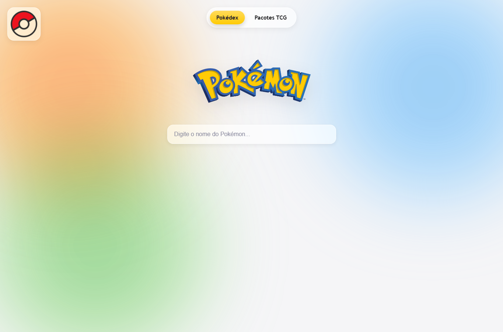
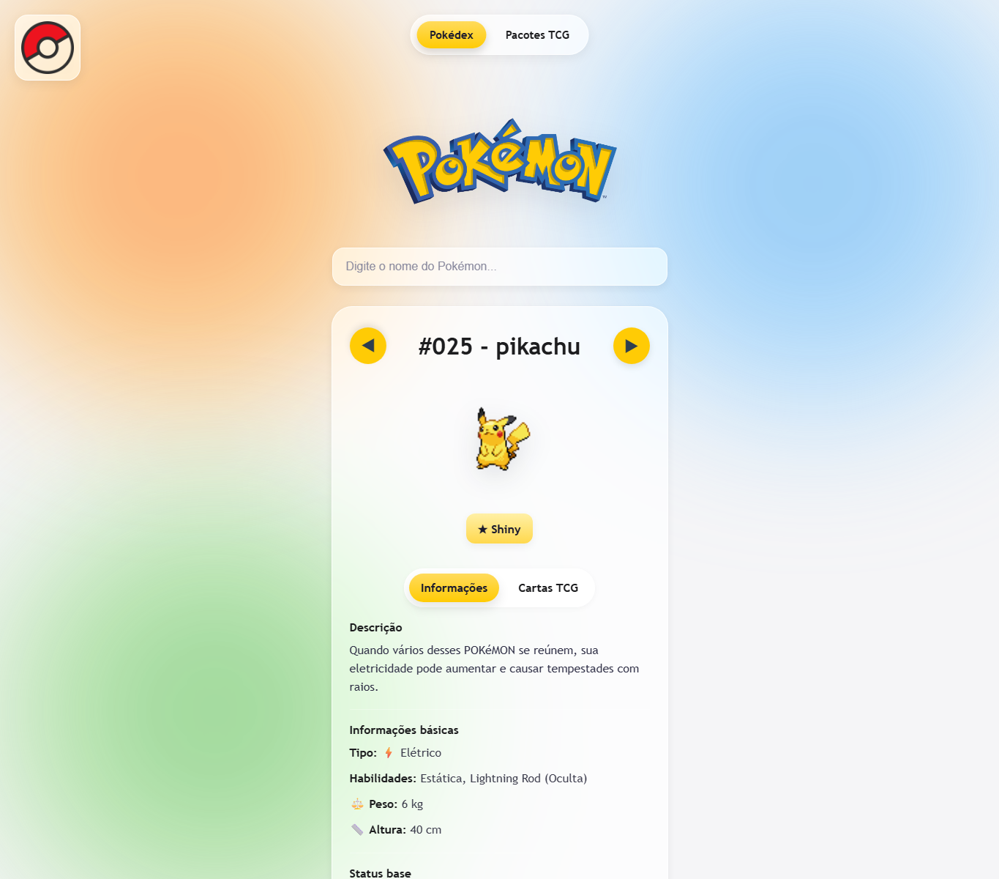
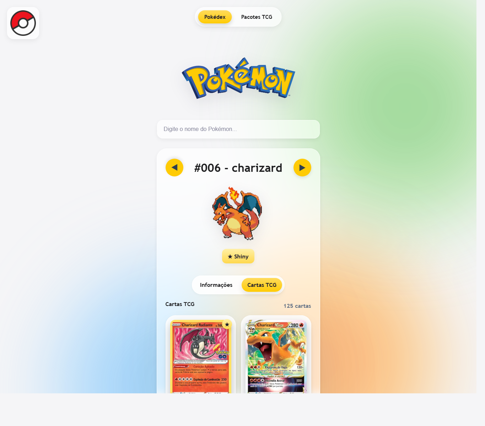
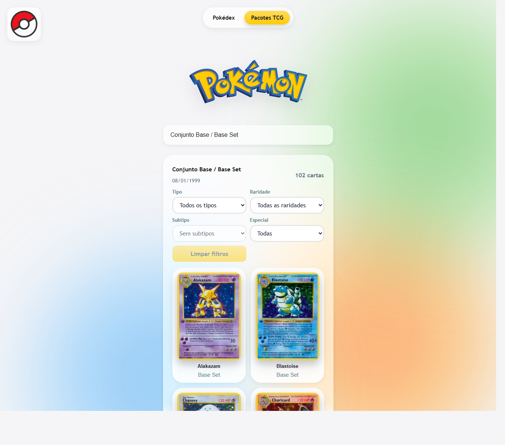
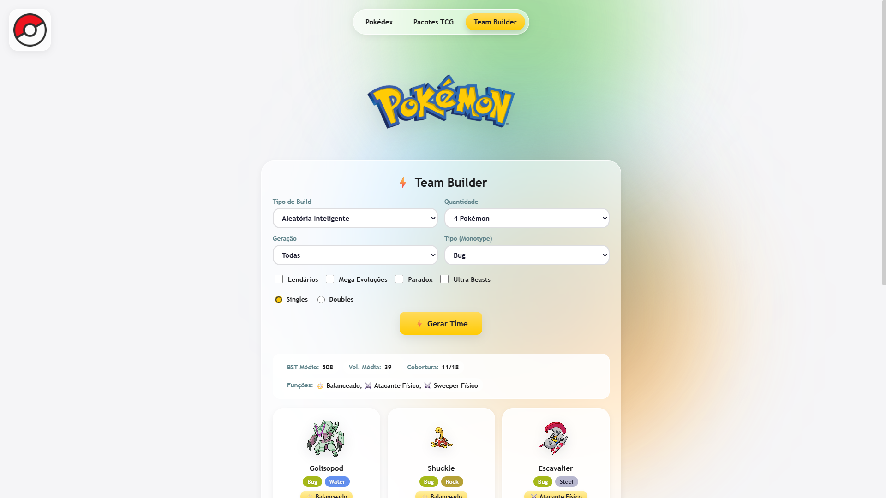

<div align="center">

  

  <br>

  <p>
    <a href="https://davi3ds.github.io/PokeHub/">
      
    </a>
    &nbsp;&nbsp;
    <a href="https://github.com/DAVI3DS/PokeHub">
      
    </a>
  </p>

  <p>
    
    
    
    
    
  </p>

  <h1>⚡ PokeHub</h1>

  <p>
    Seu hub completo do universo Pokémon — Pokédex inteligente, cartas TCG e <strong>Team Builder</strong> automático.
  </p>

</div>

---

<h2 align="center">📖 Sobre o Projeto</h2>

<p align="center">
  O <strong>PokeHub</strong> é uma plataforma Pokémon completa com visual inspirado no universo dos monstrinhos. 
  Pesquise por qualquer Pokémon, explore informações detalhadas, cadeias de evolução, 
  versões shiny, cartas TCG, pacotes de cartas — e monte times inteligentes 
  com um algoritmo que entende de sinergia, cobertura e estratégia.
</p>

<div align="center">
  
</div>

---

<h2 align="center">⚡ Funcionalidades</h2>

<table>
  <tr>
    <td width="50%" align="center">
      
      <br>
      <strong>🔍 Busca de Pokémon</strong>
      <br>
      Pesquise pelo nome e veja sugestões enquanto digita.
    </td>
    <td width="50%" align="center">
      
      <br>
      <strong>📋 Informações completas</strong>
      <br>
      Tipo, habilidades, peso, altura, status base e descrição.
    </td>
  </tr>
  <tr>
    <td width="50%" align="center">
      
      <br>
      <strong>🔗 Evoluções</strong>
      <br>
      Navegação entre a cadeia de evolução do Pokémon pesquisado.
    </td>
    <td width="50%" align="center">
      
      <br>
      <strong>✨ Modo shiny</strong>
      <br>
      Alterna o sprite normal e shiny quando disponível.
    </td>
  </tr>
  <tr>
    <td width="50%" align="center">
      
      <br>
      <strong>⚔️ Fraquezas e resistências</strong>
      <br>
      Calcula relações de dano pelos tipos do Pokémon.
    </td>
    <td width="50%" align="center">
      
      <br>
      <strong>📜 Histórico de pesquisa</strong>
      <br>
      Guarda os últimos Pokémon pesquisados no navegador.
    </td>
  </tr>
  <tr>
    <td width="50%" align="center">
      
      <br>
      <strong>🃏 Cartas TCG</strong>
      <br>
      Busca cartas relacionadas ao Pokémon usando a TCGdex.
    </td>
    <td width="50%" align="center">
      
      <br>
      <strong>📦 Pacotes TCG</strong>
      <br>
      Pesquisa pacotes, lista cartas, filtra por tipo, raridade e especiais.
    </td>
  </tr>
  <tr>
    <td width="50%" align="center" colspan="2">
      
      <br>
      <strong>🧠 Team Builder Inteligente</strong>
      <br>
      Monte times otimizados com algoritmo que considera tipagem,<br>
      cobertura ofensiva, sinergia defensiva, roles e stats de cada Pokémon.<br>
      <br>
      <strong>⚙️ 8 estratégias:</strong> Balanceada • Ofensiva • Defensiva • Suporte<br>
      Hyper Offense • Stall • Monotype • Aleatória Inteligente<br>
      <br>
      <strong>🎛️ Filtros:</strong> Quantidade • Geração • Lendários • Mega • Paradox • Ultra Beasts
    </td>
  </tr>
</table>

---

<h2 align="center">📸 Preview</h2>

<p align="center">
  
  
</p>

<p align="center">
  
  
</p>

<p align="center">
  
</p>

---

<h2 align="center">🏗️ Arquitetura</h2>

<p align="center">
  Projeto estruturado para crescer — cada funcionalidade principal em arquivos separados.
</p>

<table>
  <tr>
    <td><strong>Arquivo</strong></td>
    <td><strong>Função</strong></td>
  </tr>
  <tr>
    <td><code>index.html</code></td>
    <td>Estrutura principal + scripts legados</td>
  </tr>
  <tr>
    <td><code>styles.css</code></td>
    <td>Design system — glassmorphism, cores, animações, responsivo</td>
  </tr>
  <tr>
    <td><code>team-builder.js</code></td>
    <td>Algoritmo inteligente de montagem de times + UI</td>
  </tr>
  <tr>
    <td><code>team-builder.css</code></td>
    <td>Estilos exclusivos do Team Builder</td>
  </tr>
</table>

---

<h2 align="center">🚀 Como Rodar</h2>

<p align="center">
  Ou acesse direto: <a href="https://davi3ds.github.io/PokeHub/">https://davi3ds.github.io/PokeHub/</a>
</p>

```bash
git clone https://github.com/DAVI3DS/PokeHub.git
cd PokeHub
```

Depois é só abrir o arquivo `index.html` no navegador.

Se quiser rodar com um servidor local:

```bash
python -m http.server 8000
```

Abra no navegador:

```text
http://localhost:8000
```

---

<h2 align="center">🔌 APIs Usadas</h2>

<table>
  <tr>
    <td align="center">
      
      <br>
      <strong><a href="https://pokeapi.co/">PokeAPI</a></strong>
    </td>
    <td>Busca dados dos Pokémon, sprites, tipos, espécies e evolução.</td>
  </tr>
  <tr>
    <td align="center">
      
      <br>
      <strong><a href="https://www.tcgdex.dev/">TCGdex API</a></strong>
    </td>
    <td>Busca cartas, pacotes, imagens, raridades e dados do TCG.</td>
  </tr>
  <tr>
    <td align="center">
      
      <br>
      <strong>Tradutores externos</strong>
    </td>
    <td>Usados como apoio para traduzir descrições quando necessário.</td>
  </tr>
</table>

---

<h2 align="center">📁 Estrutura</h2>

```text
PokeHub/
├── index.html
├── styles.css
├── team-builder.css
├── team-builder.js
├── tcg_set_base1.json
├── LICENSE
├── .github/
│   └── workflows/
└── recursos/
    ├── images/
    │   ├── Pokedex-Logo.png
    │   ├── Pokemon-Logo.png
    │   └── pokedex.png
    └── preview/
        ├── preview-home.png
        ├── preview-pokemon.png
        ├── preview-tcg.png
        ├── preview-pack.png
        └── preview-team-builder.png
```

---

<h2 align="center">🧪 Próximos Passos</h2>

<table>
  <tr>
    <td>💥 Sugestão automática de golpes (Movesets)</td>
    <td>📦 Sugestão de itens</td>
  </tr>
  <tr>
    <td>🧬 Sugestão de habilidades</td>
    <td>🌟 Sugestão de Nature</td>
  </tr>
  <tr>
    <td>📊 Sugestão de EVs/IVs</td>
    <td>⭐ Sistema de avaliação da equipe</td>
  </tr>
  <tr>
    <td colspan="2">🎮 Exportação do time para Pokémon Showdown</td>
  </tr>
</table>

---

<h2 align="center">📜 Licença</h2>

<p align="center">
  Este projeto está sob a licença <strong>Apache 2.0</strong>. Veja o arquivo <a href="./LICENSE">LICENSE</a> para mais detalhes.

<em>Se você usar ou modificar este projeto, mantenha os créditos do autor original (DAVI3DS) nos arquivos.</em>
</p>

<p align="center">
  Pokémon, Pokédex e imagens relacionadas pertencem aos seus respectivos donos.<br>
  Este projeto é apenas para estudo.
</p>

---

<h2 align="center">🛠️ Tecnologias</h2>

<p align="center">
  
  
  
  
  
</p>

---

<div align="center">
  
  

  <p>
    Feito com ❤️ para estudar API, manipulação de DOM, busca, filtros e interface web.
  </p>

  <p>
    <strong>"Gotta Build 'Em All!"</strong> 🏆
  </p>
</div>
